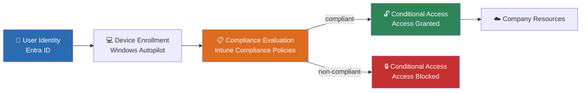

# Enterprise Endpoint Management Reference Lab

Hands-on reference environment for designing and validating modern workplace security using Microsoft Intune, Entra ID, Windows Autopilot and Conditional Access.

---

## Project Overview

Organizations moving to a cloud-first workforce need a way to trust devices, not just users — a lost or unmanaged laptop shouldn't be able to reach company data just because someone signed in correctly. This lab documents a complete Zero Trust device management environment: from identity, through enrollment and compliance evaluation, to access enforcement.

This lab focuses on **real-world security architecture**, not just feature configuration.

---

## Architecture Overview



Rather than documenting isolated features, this repository follows the lifecycle of modern endpoint security:

1. **Identity** → Who is requesting access?
2. **Device Enrollment** → What device is being used?
3. **Compliance** → Can the device be trusted?
4. **Conditional Access** → Should access be granted?

Together, these layers form the foundation of a Zero Trust access model.

---

## Key Security Scenario Implemented

- Enrolled a Windows device into Intune via Autopilot
- Forced a non-compliant state intentionally
- Implemented Conditional Access requiring compliant devices
- Validated enforcement through sign-in telemetry
- Successfully blocked cloud access from an untrusted device

This demonstrates how device posture directly impacts authorization decisions — not just theoretically, but validated end-to-end in a live tenant.

---

## Repository Structure

```
docs/md102/
├── identity-access.md              → Identity foundation and access concepts
├── device-enrollment.md            → Azure AD Join and MDM enrollment (Autopilot)
├── compliance-security.md          → Device trust evaluation
└── conditional-access-enforcement.md → Access control based on compliance state
```

---

## Lessons Learned / Troubleshooting

### Entra ID join and Intune enrollment are separate processes
Creating a device identity in Microsoft Entra ID does not automatically mean the device is managed by Microsoft Intune. Join state and MDM enrollment state must be checked separately:

```powershell
dsregcmd /status
```

Relevant values: `AzureAdJoined`, `DomainJoined`, `WorkplaceJoined`, tenant information, device ID.

### Automatic enrollment depends on several prerequisites
A successful Entra join alone is not proof of successful Intune enrollment. Automatic enrollment only works when all of the following are met: a supported Intune license, the user being included in the MDM user scope, a supported Windows edition, a successful Entra join, and correct tenant/enrollment restrictions.

### Registered, joined, and enrolled are not the same thing
The lab clarified the practical difference between Microsoft Entra **registered**, Entra **joined**, **hybrid** Entra joined, and Intune **enrolled** — four different states describing different aspects of device identity and management, easy to conflate when troubleshooting.

### Device visibility and policy deployment are not instantaneous
The device did not always appear immediately across Entra ID, Intune, and the Windows client — synchronization takes time. Before assuming a configuration failed, a manual sync and another device check-in should be triggered first. The same applies to policies: assignment, include/exclude groups, enrollment status, last check-in, OS applicability, and sync status should all be verified before troubleshooting the policy content itself.

### Conditional Access needs careful staged testing
Conditional Access can block access before a device is fully enrolled and compliant. In lab environments, policies should first run in **report-only mode** or be scoped to a dedicated test group, with emergency/admin accounts excluded to avoid accidental lockout.

### Troubleshooting should follow the management chain
A reliable order that avoids chasing the wrong layer:
1. Verify the Windows device state (`dsregcmd /status`)
2. Verify the Microsoft Entra device object
3. Verify the Intune enrollment
4. Verify licensing and MDM scope
5. Verify group membership and assignments
6. Trigger synchronization
7. Review policy and enrollment logs

---

## Purpose

This repository serves as:

- A deep technical learning environment
- MD-102 certification support
- A security architecture reference
- A demonstration of practical endpoint engineering skills

---

## Out of Scope

To maintain architectural clarity, this lab intentionally excludes:

- On-prem Active Directory
- Hybrid Join
- Legacy management models
- Production workloads

The focus is fully on **cloud-native device management.**

---

## Direction

Future expansions will explore:

- Device remediation workflows
- Risk-based Conditional Access
- MFA + device trust layering
- Update governance
- Security baselines
- Endpoint hardening
