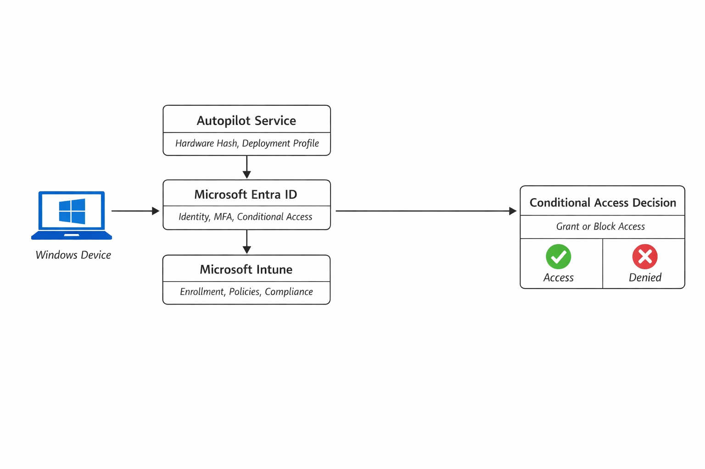
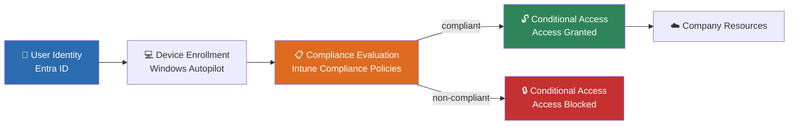

# Enterprise Endpoint Management Reference Lab

Hands-on reference environment for designing and validating modern workplace security using Microsoft Intune, Entra ID, Windows Autopilot and Conditional Access.

---

## Project Overview

Organizations moving to a cloud-first workforce need a way to trust devices, not just users — a lost or unmanaged laptop shouldn't be able to reach company data just because someone signed in correctly. This lab documents a complete Zero Trust device management environment: from identity, through enrollment and compliance evaluation, to access enforcement.

This lab focuses on **real-world security architecture**, not just feature configuration.

---

## Architecture Overview





Rather than documenting isolated features, this repository follows the lifecycle of modern endpoint security:

1. **Identity** → Who is requesting access?
2. **Device Enrollment** → What device is being used?
3. **Compliance** → Can the device be trusted?
4. **Conditional Access** → Should access be granted?

Together, these layers form the foundation of a Zero Trust access model.

---

## Key Security Scenario Implemented

- Enrolled a Windows device into Intune via Autopilot
- Forced a non-compliant state intentionally
- Implemented Conditional Access requiring compliant devices
- Validated enforcement through sign-in telemetry
- Successfully blocked cloud access from an untrusted device
- Restored device trust and re-validated access after remediation

This demonstrates how device posture directly impacts authorization decisions — not just theoretically, but validated end-to-end in a live tenant. Full walkthrough with policy names, report-only testing, and sign-in log validation: [`docs/md-102/conditional-access-enforcement.md`](docs/md-102/conditional-access-enforcement.md)

---

## Repository Structure

```
architecture/
└── autopilot-entra-intune-ca.png     → End-to-end architecture diagram

docs/md-102/
└── conditional-access-enforcement.md → Full Zero Trust scenario: policy design,
                                         report-only testing, enforcement, remediation

docs/practice/
├── tenant-setup.md                   → Lab tenant, admin roles, groups
├── autopilot.md                      → Autopilot deployment walkthrough
├── autopilot-flow.md                 → Full Autopilot → Entra → Intune → CA execution order
├── identity-access.md                → Conditional Access practice notes
├── enrollment.md                     → Policy scope troubleshooting (device vs. user)
├── conditional-access-vs-compliance.md → Clear separation of CA, Compliance, Configuration
└── windows-update-for-business.md    → Update Rings vs. Feature Update Policies

notes/
└── lessons-learned.md                → Real issues hit during this lab, root causes, fixes
```

---

## Lessons Learned / Troubleshooting

*Full detail in [`notes/lessons-learned.md`](notes/lessons-learned.md) — summary below.*

### Tenant verification deadlock
Initial tenant got stuck in verification for over 7 days with billing actions blocked. Rebuilding a clean tenant turned out faster than waiting: **if verification exceeds ~5 days with billing blocked, rebuild rather than wait.**

### Device-only settings assigned to the wrong scope silently fail
A BitLocker configuration policy showed zero evaluation results — not an error, just silence. Root cause: the policy was assigned to a **user** group although the setting was device-only. Reassigning it to a device group fixed evaluation immediately. **A valid policy with the wrong scope behaves as if it doesn't exist — no error, no signal.**

### Configuration Policies enforce; Compliance Policies report
A configuration policy successfully enforced BitLocker, but its policy-level reporting stayed empty — because the device already met the required state before assignment. Configuration policies enforce state; compliance policies evaluate state and are the authoritative signal for Conditional Access. **Policy-overview dashboards lag; device-level views are the reliable source of truth.**

### Autopilot Device Preparation depends on service principal permissions, not admin roles
Device Preparation policy creation failed with an ownership error on the target group — caused by the Intune Provisioning Client service principal not being an owner of that group, independent of the admin account's own permissions. Assigning the service principal as group owner resolved it.

### Enrollment must succeed before compliance can be evaluated
Initial assumption was that a device must be compliant before it can enroll. Actual behavior is the reverse: sign-in and enrollment happen first, compliance is evaluated afterward, and Conditional Access only enforces it at resource access — not during setup.

### Hardware hash registration is hardware-based, not installation-based
After a device reset, Windows still reported the device as already registered — the hardware hash persists until explicitly removed from Autopilot, regardless of how many times the OS is reinstalled.

### Update Rings ≠ Feature Update Policies
A successful Update Ring assignment doesn't guarantee a visible OS version change — Update Rings control *how* updates roll out (timing, deferral, restarts), while a separate Feature Update Policy is required to control *which* Windows version is targeted.

### Custom Compliance Policies can be unreliable for demos
Custom compliance policies sometimes stayed in "Not applicable" in a tenant- and timing-dependent way — not suitable for deterministic Conditional Access demonstrations. User- and app-based CA conditions proved more reliable for testing and documentation.

---

## Purpose

This repository serves as:

- A deep technical learning environment
- MD-102 certification support
- A security architecture reference
- A demonstration of practical endpoint engineering skills

---

## Out of Scope

To maintain architectural clarity, this lab intentionally excludes:

- On-prem Active Directory
- Hybrid Join
- Legacy management models
- Production workloads

The focus is fully on **cloud-native device management.**
